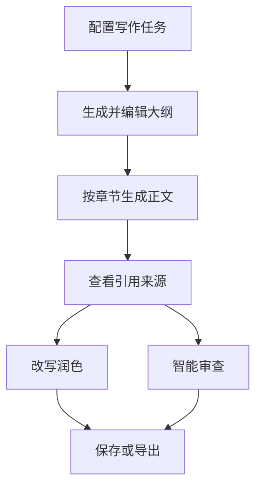

<div align="center">

# AI Writer Studio

面向政务与企业场景的结构化 AI 长文写作工作台

[](https://react.dev/)
[](https://www.typescriptlang.org/)
[](https://tanstack.com/start)
[](https://tailwindcss.com/)

</div>

## 项目简介

AI Writer Studio 是一个面向政务、国企及企业行政写作场景的桌面端 Web 原型。产品将传统 Chatbot 的自由对话改造为“参数配置—大纲规划—分章生成—引用溯源—润色审查”的结构化工作流，重点解决长文结构难控制、业务知识难引用和生成内容难追溯的问题。

> 当前仓库为可完整演示的前端交互原型，使用 Mock 数据模拟 AI 与知识库能力，不包含真实大模型、RAG、文件解析及数据库服务。

## 核心功能

| 模块     | 已实现能力                                                     |
| -------- | -------------------------------------------------------------- |
| AI 写作  | 文章类型与模板配置、概要/大纲生成、目录编辑、分章节生成进度    |
| 引用溯源 | 正文引用标记、来源信息悬停、文档详情查看与原文切片定位         |
| 改写润色 | 划词选择、扩写/精简/续写/总结、自定义要求、结果替换            |
| 智能审查 | 政治敏感、语法逻辑、格式规范、法律条款四类检查，支持采纳或忽略 |
| 保存导出 | `localStorage` 状态恢复、操作反馈、HTML 全文导出               |

## 产品流程



## 设计亮点

- **结构优先：**以表单和目录拆解替代纯聊天交互，提升长文生成的可控性。
- **引用可追溯：**从引用编号进入来源文档，并定位至对应页码与内容切片。
- **人机协同：**润色结果可编辑后替换，审查建议可逐条采纳、忽略或批量处理。
- **完整状态反馈：**覆盖空状态、加载进度、输入校验、成功提示与结果状态。
- **稳定演示：**纯前端 Mock 数据驱动，无后端依赖，适合产品方案与交互原型展示。

## 技术栈

- React 19 + TypeScript
- TanStack Start + TanStack Router
- Tailwind CSS 4
- Radix UI / shadcn/ui
- Lucide React
- Vite 8

## 本地运行

推荐使用 [Bun](https://bun.sh/)：

```bash
git clone https://github.com/twofishll/ai-writer-studio.git
cd ai-writer-studio
bun install
bun run dev
```

根据终端提示打开本地地址即可体验。

## 演示建议

1. 填写文章标题，生成内容概要与文章大纲。
2. 编辑目录后生成全文，观察分章节生成进度。
3. 点击正文引用，查看来源文档并定位原文切片。
4. 选中正文体验改写润色，再运行智能审查并处理建议。
5. 保存当前状态或导出 HTML 全文。

## 项目结构

```text
src/
├── components/ui/      # 通用 UI 组件
├── lib/                # 工具与错误处理
├── routes/index.tsx    # 工作台页面、状态与核心交互
├── routes/__root.tsx   # 应用根布局
└── styles.css          # 全局样式与设计变量
```

## 后续规划

- 接入真实大模型与分章节生成 Workflow
- 建设文档解析、切片、向量检索与引用回溯链路
- 增加用户权限、任务管理及服务端持久化
- 支持 Word/PDF 导出与审查规则配置

---

本项目用于 AI 产品方案、交互设计与前端原型能力展示。
